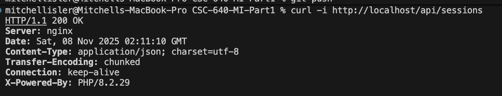

# Deployment Guide
## CSC-640-MI Telemetry API

Step-by-step deployment using Docker Compose

---

## Prerequisites

**Required Software:**
- Docker Desktop (includes Docker Compose)
- Git (to clone the repository)

---

## Step 1: Clone the Repository

```bash
git clone https://github.com/islerm2-nku/CSC-640-MI-Part1.git
cd CSC-640-MI-Part1
```

**What's included:**
- PHP application code
- Python telemetry parser
- Docker configuration files
- Database migration scripts
- Example telemetry files

---

## Step 2: Build and Start Containers

```bash
docker-compose up --build -d
```

**What this does:**
- Builds the web container (PHP + nginx + Python)
- Starts MySQL database container
- Creates network between services
- Exposes port 80 for API access

**Wait 10-15 seconds** for MySQL to initialize completely

---

## Step 3: Run Database Migration

```bash
docker-compose run --rm migrate
```

**Creates database tables:**
- `session_info` - session metadata
- `weather` - track conditions
- `driver` - driver and car information
- `attribute_values` - telemetry time-series data

**Output:**
```
Migration complete: session_info, weather, and driver tables created successfully
```

---

## Step 4: Verify Deployment

**Test the API is running:**

```bash
curl -i http://localhost/api/sessions
```

---

## Deployment Verification




**Key indicators:**
- ✅ `HTTP/1.1 200 OK` - successful response
- ✅ `Server: nginx` - nginx web server is running
- ✅ `X-Powered-By: PHP/8.2.29` - PHP is processing requests
- ✅ `Content-Type: application/json` - API is returning JSON

---

## Container Status Check

**Verify all containers are running:**

```bash
docker-compose ps
```

**Expected output:**
```
NAME                  STATUS    PORTS
csc-640-mi-web        Up        0.0.0.0:80->80/tcp
csc-640-mi-db         Up        3306/tcp
```

**Alternative:**
```bash
docker ps
```

---

## Viewing Logs

**Web container (nginx + PHP):**
```bash
docker-compose logs -f web
```

**Database container:**
```bash
docker-compose logs -f db
```

**All containers:**
```bash
docker-compose logs -f
```

---

## Troubleshooting

**Container won't start:**
- Check port 80 isn't already in use: `lsof -i :80`
- Restart Docker Desktop
- Run: `docker-compose down && docker-compose up --build -d`

**Migration fails:**
- Ensure MySQL is ready: wait 15 seconds after starting
- Check DB logs: `docker-compose logs db`
- Run migration manually: `docker-compose exec web php /var/www/html/db/create_db.php`

---

## Stopping the Application

**Stop containers (preserve data):**
```bash
docker-compose stop
```

**Stop and remove containers:**
```bash
docker-compose down
```

**Stop and remove containers + volumes (deletes database):**
```bash
docker-compose down -v
```

---

## Restarting the Application

**After stopping:**
```bash
docker-compose up -d
```

**No need to rebuild or re-run migrations** unless:
  
- Database schema changed
- Volumes were deleted with `-v` flag

---

## Summary

**Deployment is complete when:**

1. ✅ Containers are running (`docker-compose ps`)
2. ✅ Database tables created (migration successful)
3. ✅ API responds to requests (nginx proof screenshot)
4. ✅ Upload endpoint accepts `.ibt` files

**Total deployment time:** ~2 minutes

**Resources:**
- API documentation: `API_CURL.md`
- Example files: `telemetry/` directory
- Postman collection: `PostmanCollection.json`

---

## Questions?

**Need help?**
- Check logs: `docker-compose logs`
- Review README: `README.md`
- Inspect containers: `docker inspect <container>`

Thank you!
